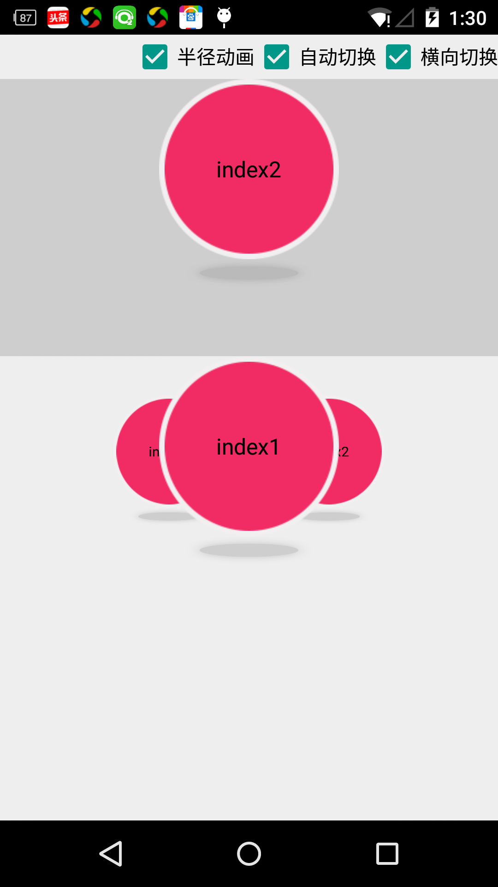

#介绍
可以无限循环，自动旋转，停靠的3D旋转布局控件,无需编写代码，直接在布局中加入自己的布局即可。 
仅使用三角函数,使用ValueAnimation,继承FrameLayout.兼容所有滑动组件
##优势
*3d旋转GrallyView，继承FrameLayout 
*支持自动旋转 
*可直接在xml添加元素即可添加列数据。无需编写代码添加 
*优良的兼容性，和尺寸控制 
##如何使用？
<code>
<com.cry.animation.LoopView 
        android:id="@+id/loopview" 
        android:layout_width="fill_parent" 
        android:layout_height="fill_parent" 
        android:gravity="center_vertical" 
        > 
  <!--  此处添加你的布局元素，可以用layout包裹 --!> 
       <ImageView 
         android:layout_width="130dp" 
         android:layout_height="20dp" 
         android:scaleType="fitXY" 
         android:paddingLeft="20dp" 
         android:paddingRight="20dp" 
         android:src="@drawable/image_shader"/>
        ............... 
 </com.cry.animation.LoopView>
 <code>
##问题反馈和联系方式
qq:347284221 
邮箱:zhuxiujia@qq.com 
