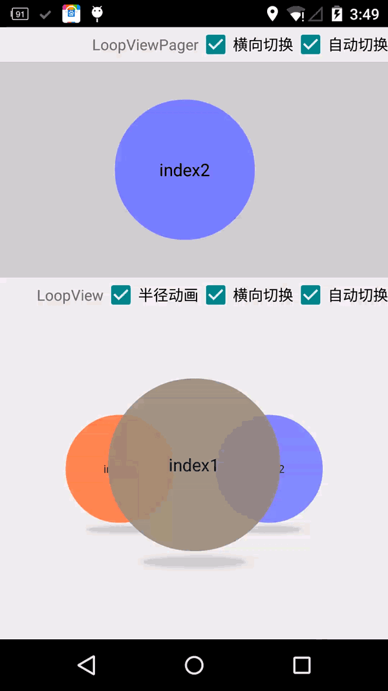
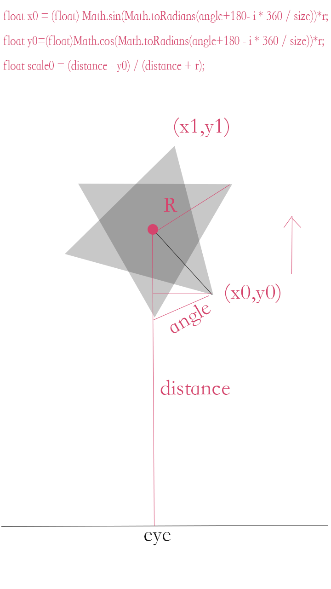

#介绍
LoopViewPager-------->继承自FrameLayout，不仅支持无限循环，相比android.support.v4中的ViewPager，更加简单易用。PS目前很多人实现是用int最大值的办法，但是数量必须在3个以上，不好.Loop是底层实现，仅仅缓存一个view 
LoopView     ------> 继承自RelativeLayout，不仅支持无限循环，而且有许多酷炫的动画和自定义功能，支持x轴，z轴，半径的动态 改变外观。非常易于使用。 
##[点击下载最新版本jar文件   jar file](https://github.com/zhuxiujia/LoopView/blob/master/loopview-1.4.5.jar?raw=true) 
 

##优势
*3d旋转GrallyView，继承FrameLayout 
*LoopViewPager不仅支持无限循环，还支持左右和上下切换，同时支持Handler实现的自动切换
*支持使用Handler实现的自动旋转，相比使用线程更加节省性能 
*可直接在xml添加元素即可添加列数据。无需编写代码添加 
*优良的兼容性，和尺寸控制 
##如何使用？
###Step1:导入jar文件到项目
###Step2:在你的layout目录下编写加入你的xml文件
        <com.cry.loopviews.LoopView
        android:layout_width="fill_parent"
        android:layout_height="fill_parent"
        android:gravity="center_vertical"
        >
              <!--此处添加你的任意View或者layout元素 -->
        <ImageView
        android:layout_width="200dp"
        android:layout_height="200dp"
        android:src="@drawable/ic_launcher"    
        />
              <!-- 可以包裹任意多的view 和layout -->
        </com.cry.loopviews.LoopView>
##问题反馈和联系方式
qq:347284221 
邮箱:zhuxiujia@qq.com 
##原理示意图
